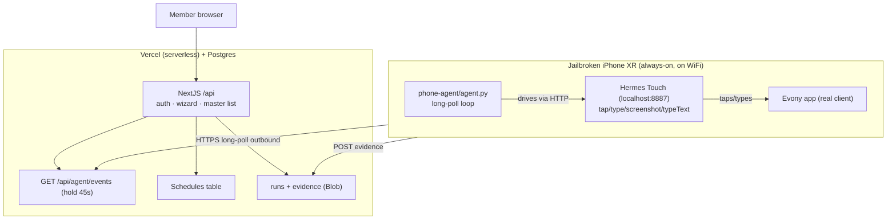

## 01 — Cloud (Vercel, NextJS + Postgres + Blob)

Everything user-visible lives here: email-login (unhashed email is both the app login and
the Evony login, per docs/01), linking wizard, master list (operator-only), per-user
dashboards, schedules, run ledger, evidence screenshots.

### Data model (webapp/migrations/001_initial.sql)

- `users` — id, email (plaintext, unique), evony_name, is_operator
- `sessions` — token_hash (sha256 of raw token), user_id, expires_at
- `link_events` — id, user_id, email, kind (link|code), status, expires_at (transient!)
- `schedules` — id, user_id, weekdays (bitmask), time "HH:MM", gem_ack, active
- `jobs` — id, kind (run|link|code), user_id, payload JSON, status, uniq (idempotency),
  expires_at (code TTL/lease timing)
- `runs` — id, user_id, trigger, status, shield_hours_remaining, evidence_ref, error

### Scheduler (no cron)

The cloud computes "what is due right now?" on each long-poll round (lib/scheduler.ts):
Given `now` weekday + "HH:MM" in the cloud's schedule UTC, it materializes a `jobs.run` row
for any schedule whose weekday bitmask + time equals now, guarded by the uniq key
`run:{user_id}:{weekday}:{HH:MM}` so the same slot is never created twice.

Events delivered over long-poll:

| kind | when | payload |
|---|---|---|
| `run` | schedule hit / operator "Run now" | email, evony_name, trigger |
| `link` | wizard step 2 (new email) | email (type it in Evony) |
| `code` | wizard step 3 (6 digits) + TTL | the code, link id, TTL (~85s) |

## 02 — Phone-agent (Python, on-device)

- `agent.py` — main loop: long-poll GET /api/agent/events; dispatch event; report via
  POST /api/agent/runs.
- `evony.py` — orchestration: launch Evony, guard each screen (email login → code dialog →
  world view), apply 3-day Truce (7500 gems), verify countdown ≥3d, close.
- `vision.py` — OpenCV template match + tesseract OCR on device.
- `iphone/transport.py` — Hermes Touch HTTP client (localhost). No USB, no host machine.
- Runs as a LaunchDaemon (bootstrap/com.bubbler.agent.plist) so it survives resprings between
  bubbles.

The phone stays moderately online (long-poll hold ≈45s, reconnect ~instant). Evony is only
opened when actually applying/verifying, then closed — the game is never left idling online.

## 03 — Transport

- Phone → cloud: HTTPS (bearer token) — outbound only, survives NAT, no tunnel needed.
- Phone → Evony: Hermes Touch over localhost HTTP (tap/type/screenshot).
- Deployment: webapp → `vercel deploy --prod` (see 06-runbook); agent → ssh (setup only).