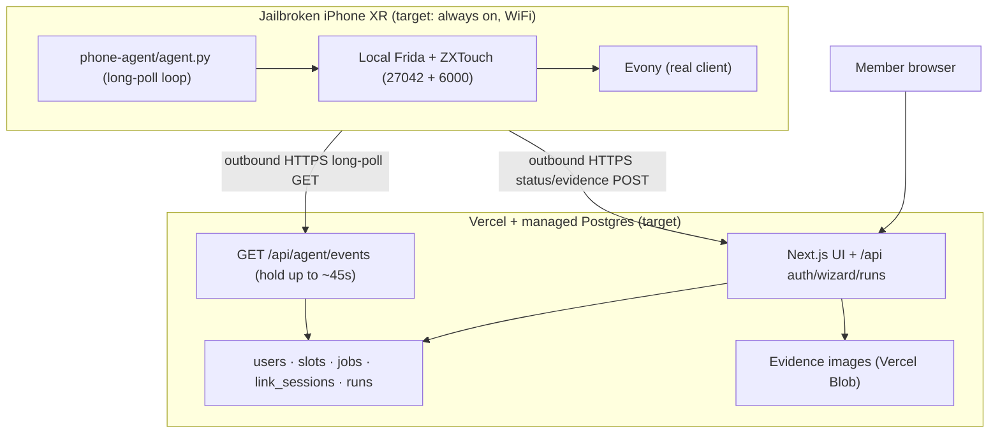

# 02 — Architecture (target and current implementation)

The **target** is a phone-originated HTTPS long-poll to a Vercel-hosted Next.js API with a
shared, persistent Postgres database. Evony + the Python agent run on the jailbroken phone;
GitHub is the source of truth. This topology is implemented in part, **not yet proven
phone-only**. The operator has confirmed that Evony email/code linking works with new
users/emails in the current test setup; see [07 — cutover](07-cutover.md).

## Cloud: current code vs deployment target

- `webapp/` contains the UI, API and DB adapter (`webapp/lib/db.ts`). Locally, without a
  DB URL, it uses **SQLite** (`webapp/data/bubbler.db`). In Vercel, configure a **persistent
  managed Postgres** connection (`DATABASE_URL` or `POSTGRES_URL`) for *both build and
  runtime*. Do not rely on serverless filesystem SQLite; the checked-in SQLite fixture has
  been removed. `webapp/scripts/migrate.ts` runs in `npm run build` and must be reviewed
  against real data before pointing it at a production DB (`migrate()` currently drops the
  old `schedules` table).
- Actual schema lives in `webapp/lib/db.ts` (not a `migrations/*.sql` file): `users`
  (plaintext email, Evony name, operator flag), `sessions` (hashed bearer/cookie token),
  `slots` (weekday + time UTC, one row per slot), `link_sessions` (wizard state), `jobs`
  (run/link/code payload + status), `runs` (result/evidence reference). Public evidence
  URLs use Vercel Blob; configure `BLOB_READ_WRITE_TOKEN` only when enabling evidence.
- **Evony linking is not app authentication.** The former passed new-user/email tests; the
  current `/api/auth/login` immediately creates a session for an allowed email without
  actually mailing a magic link. With no `AUTH_SEED`, any email is allowed. Fix this before
  exposing the app with real member data (see [05 — security](05-security.md)).

## “Poor man's WebSocket”: actual long-poll contract

1. The agent makes `GET /api/agent/events?hold=45` with a bearer token. The API calls
   `fillDue()` and `claimNext()`, then checks roughly every **1.5 seconds** while holding
   the request, up to the hold duration. No cron, WebSocket server or inbound phone port.
   The endpoint declares a 60-second max function duration; verify actual Vercel plan and
   edge/proxy timeouts in staging.
2. Due slots match the **current UTC minute**. `fillDue` inserts one job per user/date/time
   with a unique key to avoid repeated materialization in that minute; manual runs and new
   link/code jobs are inserted by their respective API routes.
3. The response is `{ "ok": true, "event": null }` (empty hold) or an event with
   `job_id`, `kind`, `user_id`, `email`, `evony_name`, `payload`. Kinds: `run` (apply a
   truce), `link` (start Evony email login), `code` (6-digit code + link id). The agent
   immediately polls again; the wizard browser polls link status every **3 seconds**.
   While healthy, events normally arrive quickly, but there is no guaranteed latency
   during outages or sleep.
4. The agent reports link state to `POST /api/agent/links/{link_id}/status` or run results
   to `POST /api/agent/runs`, then optional evidence to
   `POST /api/agent/runs/{run_id}/evidence`.

**Reliability gap (must fix before unattended operation):** `claimNext()` reads a pending
job then updates it to `claimed` in separate queries, without an atomic claim/lease/ack.
Two pollers can pick the same job. A claimed job has no reclaim path if its response is
lost or the agent dies. Expired pending code jobs are filtered, but not automatically
purged. A claimed code job has its payload set to `{}`, but its row remains. Code delivery
currently queues the digits briefly in Postgres/SQLite; it is *not* “never stored.” Fix
these behaviors and test reconnect/resend before depending on autonomous scheduling.

## Phone agent

- `phone-agent/agent.py`: HTTP long-poll loop and link/code relay; reports results.
- `phone-agent/evony.py`: Evony UI orchestration; the **link path has passed real tests** in
  the current arrangement. 3-day truce navigation and vision-based verification still need
  calibration and end-to-end tests.
- `phone-agent/iphone/transport.py`: local ZXTouch input/screenshots and Frida support. It
  still contains a laptop-test fallback with a hard-coded SSH key path and LAN address;
  remove it in the on-device migration and test the phone's local `uiopen`/process-close
  behavior before switching off the host.
- The LaunchDaemon plist is present, but on-device Python/Frida bindings, ZXTouch,
  calibration images, daemon startup and WiFi-only recovery have **not been verified by
  this repository review**.

The phone opens Evony for work, then force-closes it. Keep the local machine as a fallback
until the [cutover acceptance tests](07-cutover.md) pass; never run a laptop agent and a
phone agent against the same queue at once.
